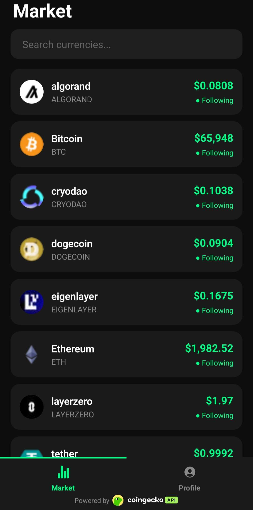
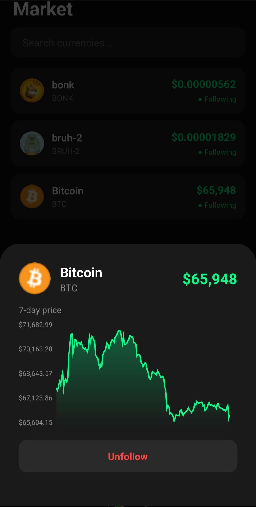

# 📈 CryptoFeed

A full-stack mobile cryptocurrency tracking app. Users sign up, follow coins they care about, and see live prices alongside a 7-day price history chart — all backed by a containerised Laravel API with Redis caching to keep CoinGecko API usage efficient.

<p align="center">
  
  &nbsp;&nbsp;&nbsp;
  
</p>
---

## ✨ Features

- **Auth** — register and login with token-based authentication via Laravel Sanctum
- **Personalised watchlists** — follow and unfollow any coin from the CoinGecko catalogue; watchlist persisted server-side per user
- **Live prices** — current prices served from Redis cache, refreshed every 5 minutes by a Laravel scheduler
- **7-day price history** — chart view per coin showing the past week's price movement
- **On-demand cache warming** — when a user is the first to follow a coin, the backend fetches and caches it immediately rather than waiting for the next scheduler cycle
- **Containerised backend** — Laravel API + Redis run together via Docker Compose (Laravel Sail), making local setup a one-command affair

---

## 🏗️ Architecture
```
┌──────────────────────┐
│   React Native App   │
│   (Expo, iOS/Android)│
│                      │
│  AsyncStorage        │
│  (token + username)  │
└──────────┬───────────┘
           │ HTTP (REST)
           ▼
┌──────────────────────┐       ┌─────────────────────┐
│   Laravel API        │──────▶│   Redis             │
│   (PHP, Sail/Docker) │◀──────│   (coin price cache)│
└──────────┬───────────┘       └─────────────────────┘
           │ Cache miss /
           │ new coin followed
           ▼
┌──────────────────────┐
│   CoinGecko API      │
│   (prices + history) │
└──────────────────────┘
           ▲
┌──────────────────────┐
│  Laravel Scheduler   │
│  (every 5 minutes)   │
│  Refreshes all       │
│  followed coins +    │
│  trending coins      │
└──────────────────────┘
```

### Caching Strategy

| Scenario | Behaviour |
|---|---|
| Coin already in Redis | Returned instantly, no CoinGecko call |
| TTL expired | Scheduler has already refreshed it before expiry |
| **User follows a brand-new coin** | **Immediate fetch from CoinGecko → written to Redis → returned to user** |

The on-demand warming pattern means the first follower of any coin never sees an empty or stale state. The follow request itself triggers the CoinGecko fetch, populates Redis, and responds — all in one cycle. From that point the scheduler takes over and keeps it fresh every 5 minutes.

---

## 🛠️ Tech Stack

| Layer | Technology |
|---|---|
| Mobile frontend | **React Native** (Expo) |
| Auth state (on-device) | **AsyncStorage** |
| Backend API | **Laravel 11 (PHP)** |
| Authentication | **Laravel Sanctum** (token-based) |
| Cache | **Redis** |
| Background jobs | **Laravel Scheduler** (runs inside Docker via shell loop) |
| Data source | **CoinGecko API** (prices & 7-day history) |
| Containerisation | **Docker Compose (Laravel Sail)** |

---

## ⚙️ How It Works

### Auth flow

1. User registers or logs in via the React Native app
2. Laravel issues a Sanctum token; token and username stored in AsyncStorage on-device
3. All subsequent API requests include the token via `Authorization: Bearer <token>`
4. Watchlist is stored server-side, associated with the authenticated user

### Viewing a coin (cache hit)

1. App requests prices from `/api/prices`
2. Laravel checks Redis → cache hit → returns immediately
3. CoinGecko is never called

### Following a new coin (cache miss)

1. User follows a coin nobody else follows yet
2. `WatchlistController::store` calls `getPricesForCoins` immediately
3. Laravel checks Redis → cache miss for that coin
4. Laravel calls CoinGecko for the current price
5. Result merged into the Redis cache with a 1-hour TTL
6. Coin added to the scheduler's active set on next run
7. User sees the price straight away — no cold-start wait

### Background scheduler

Defined in `bootstrap/app.php`, the scheduler fires `crypto:fetch` every 5 minutes. The command collects all coins from the trending config plus every distinct coin anyone is following, fetches their prices from CoinGecko in a single API call, and writes the merged result to Redis. Coins nobody follows are automatically dropped from the next fetch cycle, keeping the cache lean.

---

## 🚀 Getting Started

### Prerequisites

- [Docker Desktop](https://www.docker.com/) with WSL2 backend (Windows) or native (Mac/Linux)
- [Node.js](https://nodejs.org/) + Expo CLI
- A free [CoinGecko API key](https://www.coingecko.com/en/api)
- A physical device or emulator on the **same local network** as the backend

### Backend (Laravel + Redis via Sail)
```bash
git clone https://github.com/your-username/cryptofeed.git
cd cryptofeed/api

cp .env.example .env
# Fill in COINGECKO_API_KEY and set APP_PORT=8000 in .env

composer install
./vendor/bin/sail up -d
./vendor/bin/sail artisan migrate
```

The scheduler runs automatically inside its own Docker container defined in `compose.yaml`. No separate command needed.

### Frontend (React Native / Expo)
```bash
cd cryptofeed/mobile
npm install

# Create a .env file:
# EXPO_PUBLIC_API_URL=http://<your-local-ip>:8000

npx expo start --clear
```

> ⚠️ **Do not use `localhost`** in the mobile `.env` — on a physical device this resolves to the phone itself, not your PC. Use your machine's local IP address (e.g. `192.168.1.x`), which you can find with `ipconfig` on Windows.

### Environment Variables (backend `.env`)
```env
APP_PORT=8000
COINGECKO_API_KEY=your_key_here
REDIS_HOST=redis
REDIS_PORT=6379
CACHE_STORE=redis
```

---

## 🔑 Key Engineering Decisions

**Why Redis for caching?**
Crypto prices are read far more often than they change, and many users follow the same popular coins. Caching in Redis means those coins are fetched from CoinGecko once per scheduler cycle regardless of how many users are viewing them — keeping the app well within free-tier API rate limits.

**Why a Docker scheduler container instead of a separate queue worker?**
Laravel's built-in scheduler keeps the architecture simple — no additional queue infrastructure needed. A dedicated `scheduler` container in `compose.yaml` runs a shell loop that calls `php artisan schedule:run` every minute, aligned to the clock boundary to prevent drift. Adding new jobs is a single method call in `bootstrap/app.php`.

**Why on-demand cache warming for newly followed coins?**
Without it, the first person to follow a niche coin would get no data until the scheduler's next run (up to 5 minutes). Triggering a CoinGecko fetch synchronously on the follow request eliminates that cold-start gap — the experience is identical whether the coin is popular or brand new.

**Why AsyncStorage instead of SQLite on the mobile client?**
The app only needs to persist a token and a username on-device. AsyncStorage is the idiomatic Expo/React Native solution for this — lightweight, no schema required, and sufficient for key-value auth state. The watchlist itself lives server-side so it syncs across devices automatically when the user logs in.

**Why Laravel Sanctum for auth?**
Sanctum's token-based auth is purpose-built for mobile API clients — lightweight compared to full OAuth2 (Passport), trivial to set up, and integrates cleanly with Laravel's `auth:sanctum` middleware.

---

## 🗺️ Roadmap

- [ ] Push notifications for significant price movements
- [ ] Portfolio view with cost-basis tracking
- [ ] Price change indicators (% change over 24h) on coin cards

---

## 📄 License

MIT